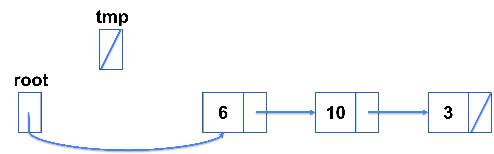
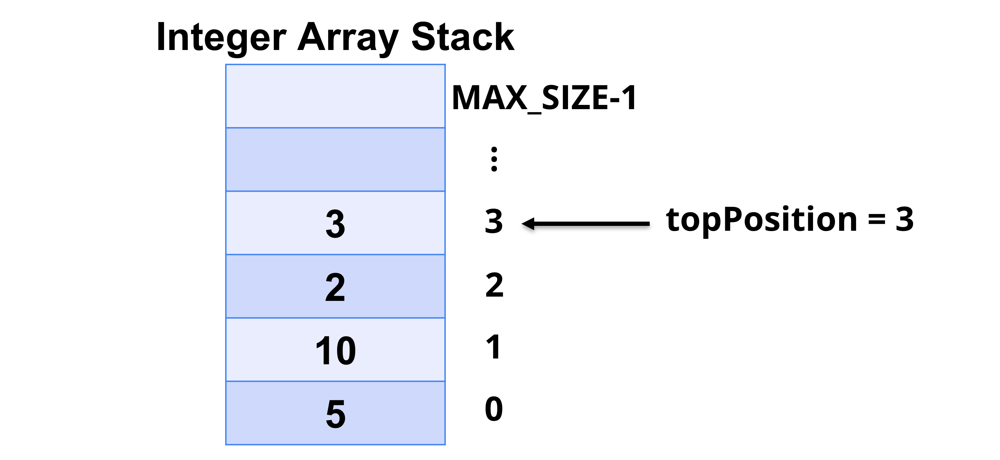

# Stacks in C: Linked List Implementation
Lecture and active learning activities teaching stacks in C, focusing on linked list based stacks.
Between the interactive lecture and exercises, I cover the following learning goals:

* Understand the conceptual idea of Stacks
* Be able to recognize when to use a Stack to solve a programming problem
* Be able to use a Stack to solve a programming problem in C
* Be able to implement a Stack using a Linked List in C


# Review of Linked List Implementation Details

Linked lists are structures that hold data, like integers, strings, bools, and are **dynamically allocated**. That is, linked lists allocate and de-allocate storage during program execution and can grow and shrink as needed.

Conceptually, you can think of a linked list as a chain of structures called nodes, where each node contains data and a pointer to the next node. Below is an example visual of a linked list that contains four integers: 1, 6, 10, and 3. The end of the list is marked with a cross and denotes a NULL pointer.


Let's build up the concepts and code needed to implement the linked list shown in the image above.

## Declaring a Node Type
The first step in implementing a list is defining a `Node` data type, which contains data and a next pointer as described previously. In C code, this can be done with a typedef on a struct as seen below:

```C
typedef struct Node {
    int value; // data held in node, here that's an integer value
    struct Node* next;  // pointer to next node in the list
} Node;
```

## Empty List

Now that we have a `Node` data type we can implement an empty list easily, simply assign a Node pointer to `NULL`:

```C
Node* root = NULL;
```

Conceptually, this looks like:


## Creating a Node & Adding it to a List

The steps involved in creating and adding a node to a linked list are:

1. Allocating memory for a node
2. Storing data in the node
3. Inserting the node in the list

We will follow these steps to implement an `addNodeFirst` function, which takes the `root` of a list and an integer `item` to be inserted, creates and adds a node to the list with data item, and returns the resulting list:

```C
Node* addNodeFirst(Node* root, int item) {
    // allocate memory for a node
        // TODO
    // store data in the node
        // TODO
    // insert the node in the list
        // TODO
}
```

### Allocating Memory for a Node

To alloc memory for a node we can use malloc as given below:

```C
Node* addNodeFirst(Node* root, int item) {
    // allocate memory for a node
    Node* n = malloc(sizeof(struct Node));
    if (n == NULL) {
        // malloc failed & heap memory is full, error!
        return root;
    } else {
        // store data in the node
            // TODO
        // insert the node in the list
            // TODO
    }
}
```
As long as heap memory is not full, `malloc` will allocate a block of memory the size of the `Node` struct and the assignment will point `n` to that block of memory. 


If `malloc` suceeds, then `n` will be non-null, otherwise `n == NULL` (i.e. when heap memory is exhausted by allocating all blocks of memory).
Since accessing a null pointer is bad (results in undefined behavior), we must handle this error case specially as seen above.


### Storing Data in Node

Once we have allocated memory for a node, we can store data in it, as seen in the `else` case below:

```C
Node* addNodeFirst(Node* root, int item) {
    // allocate memory for a node
    Node* n = malloc(sizeof(struct Node));
    if (n == NULL) {
        // malloc failed & heap memory is full, error!
        return root;
    } else {
        // store data in the node
        n->value = item;
        // insert the node in the list
            // TODO
    }
}
```

We have simply made the new node `n` contain `item`.


### Inserting Node in List

Now, to insert `n` at the head/root or first in the list, we simply make node `n`'s next pointer point to the `root` node of the list.


Then, we make `root` point to `n`'s node.


So, our `addNodeFirst` function looks like this:

```C
Node* addNodeFirst(Node* root, int item) {
    // allocate memory for a node
    Node* n = malloc(sizeof(struct Node));
    if (n == NULL) {
        // malloc failed & heap memory is full, error!
        return root;
    } else {
        // store data in the node
        n->value = item;
        // insert the node in the list
        n->next = root;
        root = n;
        return root;
    }
}
```

Note, in the `else` case `root` is returned after insertion as `root` points to the new list after insertion.


## Removing and Deleting a Node from a List
While not needed to create the list from the start of the section, being able to remove and delete a node from a list is important. This is especially true when we want to free all of our allocated memory after we are done with our list!

The steps for removing and deleting a node are as follows:
1. Locate the node to be deleted
2. Alter the previous node to bypass deleted node
3. Call `free` to reclaim space occupied by the deleted node

For simplicity let's focus on writing a function to find, remove, and delete the first node in the list given the list's root node. This function returns the resulting list after removal.

```C
Node* removeFirstNode(Node* root) {
    if (root == NULL)
        return root;
    // locate node to be deleted
        // TODO
    // alter previous node to bypass deleted node
        // TODO
    // call free to reclaim space
        // TODO
}
```

### Locate the Node to be Deleted

Since we are always removing the first integer in our list, location is simple. The node to be deleted is the one pointed to by `root`


 and so let's point a temporary pointer `tmp` to the node as well

 

In code this looks like:

```C
Node* removeFirstNode(Node* root) {
    if (root == NULL)
        return root;
    // locate node to be deleted
    Node* tmp = root;
    // alter previous node to bypass deleted node
        // TODO
    // call free to reclaim space
        // TODO
}
```

### Alter Previous Node to Bypass Deleted Node

Since we are removing the node at the root/head of the list, there is not a previous node rather the `root` pointer is what we want to bypass the deleted node (i.e. you can think of the `root` pointer as the `next` pointer from the previous node).


The code for this is below:

```C
Node* removeFirstNode(Node* root) {
    if (root == NULL)
        return root;
    // locate node to be deleted
    Node* tmp = root;
    // alter previous node to bypass deleted node
    root = root->next;
    // call free to reclaim space
        // TODO

    return root;
}
```
Note, `root` is returned by removeFirstNode, because it now points to the second node in the list, which means the first node has been removed.


### Call free to Reclaim Space

Finally, we need to de-allocate memory from (delete) the node we just removed which is pointed to by `tmp`. That is, we simply call `free` on `tmp`.



In code:
```C
Node* removeFirstNode(Node* root) {
    if (root == NULL)
        return root;
    // locate node to be deleted
    Node* tmp = root;
    // alter previous node to bypass deleted node
    root = root->next;
    // call free to reclaim space
    free(tmp);

    return root;
}
```
This is important to do so that we do not exhaust heap memory!

# Implementing a Stack with a Linked List

Recall, a **Stack** is an abstract data type (ADT) that holds a collection of data (integers, booleans, string, etc.) and preserves a First-In-Last-Out insertion and deletion strategy.

The `push` operation performs insertion by only adding a new element to the top of the stack (as long as the stack is not full). For example, 9 is added to the top of the integer stack below:


The `pop` operation performs deletion by only removing the element at the top of the stack (as long as the stack is not empty). For example, 3 is removed from the integer stack below as 3 is the integer at the top of the stack:


We can also get the data at the top of the stack using the `top` operation, which returns the data at the top of the stack (as long as the stack is not empty). For example, the integer 3 is returned from `top` in the integer stack below and the stack unmodified:  


## Linked List Based Stack ADT

As you can see, tracking the `top` of the stack is very important for `pop`, `push`, and `top`.

That's why we spent a lot of effort tracking `topPosition` correctly when implementing a Stack ADT based on an array.



So, it is not surprising that our Stack ADT also tracks the `top` of the stack, which for linked lists will be a node from our list:

```C
typedef struct Stack {
    int size;  // tracks the size of the stack
    Node* top; // tracks the top node of the stack
} Stack;
```
That is, our Stack ADT tracks the top node of the stack with a node pointer and also tracks the stack's `size` with an integer for convenience.

*Question*: Where should our `top` node point to in a linked list? Head or tail of the linked list?


*Answer*: It doesn't matter as long as we respect the conceptual ideas of a stack and its functionality, especially in terms of pushing and popping!


For efficiency and convenience, let's make our `top` node always point to the head of the list.

Now, we can implement our linked list based stack from our stack interface. Let's first review the interface, and then go over psuedo code for implementing the interface based on a linked list.

## Stack Interface

The interface for a Stack ADT for integers looks like:

```C
typedef struct Stack {
    int size;
    Node* top;
} Stack;      /* Type for a stack of integers */


bool initialize (Stack* s);

bool isEmpty (const Stack* s);

bool isFull (const Stack* s);

int pop (Stack* s);

bool push (Stack* s, int item);

int top (const Stack* s);
```

## Initializing the Stack
Initialize takes a stack `s` and initializes it, creating an empty stack. It returns true or false depending on if initialization succeeded or failed.

```C
bool initialize(Stack* s) {
    if (Stack is not malloced (s is null) or Stack is non-empty) {
        // do nothing & fail initialization
    } else {
        // initialize stack as an empty stack
    }
}
```

## Checking if the Stack is Empty
`isEmpty` returns true or false depending on whether the Stack contains any items or not.

```C
bool isEmpty(const Stack* s) {
    if (Stack is empty) {
        // return true
    } else {
        // return false
    }
}
```

## Checking if the Stack is Full

`isFull` returns true or false depending on whether the Stack contains as much data as it can hold. Since our stack is based on a linked list, which is dynamically allocated, `isFull` should always return `false` as our stack will only be "full" when the heap runs out of space.

```C
bool isFull(const Stack* s) {
    // return false
}
```

## Pushing onto the Stack
If the stack is not full, `push` adds the specified item to the top of the stack. If the stack is full, nothing is added, and an error is reported.

```C
bool push(Stack* s, int item) {
    if (Stack is full) {
        // stack overflow error!
    } else {
        // add node to the top/head of the list
        // increase stack size
    }
}
```

## Popping off the Stack
If the stack is not empty, pop removes the top item from the stack and returns it. If the stack is empty, nothing is returned, and an error is reported.

```C
int pop(Stack* s) {
    if (stack is empty) {
        // stack underflow error!
    } else {
        // save data from top node to integer variable
        // remove & delete top node, aka the first element of the list
        // decrease stack size
        // return integer variable 
    }
}
```

## Peeking at the Top Element of the Stack
If the stack is not empty, the `top` item is returned, but the contents of the stack are not changed. If the stack is empty, nothing is returned, and an error is reported.

```C
int top(Stack* s) {
    if (stack is empty) {
        // stack underflow error!
    } else {
        // return data from the top node of the list
    }
}
```
